# Travel Planner/Journal

A full-stack website for planning, and journalling trips collaboratively. This website lets users handle all aspects of planning and recording their trip, including admin (flights, accomodation, packing list, etc.) a page to explore places to visit, and an itinerary page to record the details of the trip. Data within the app is passed around to ensure intuitive user use, if a user confirms accomodation, it immediately appears in the itinerary page.

Built with Next.js, Firebase, Google Maps API, and Mapbox API.

## Features

- Itinerary View: A page to record the details of the trip (including both a timeline and calendar view), including a map with markers for each location, a timeline of events, and AI-powered tips based on the day.

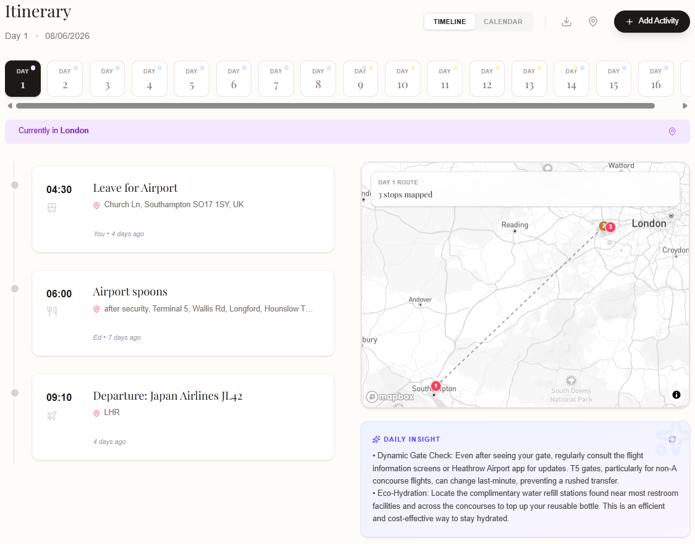
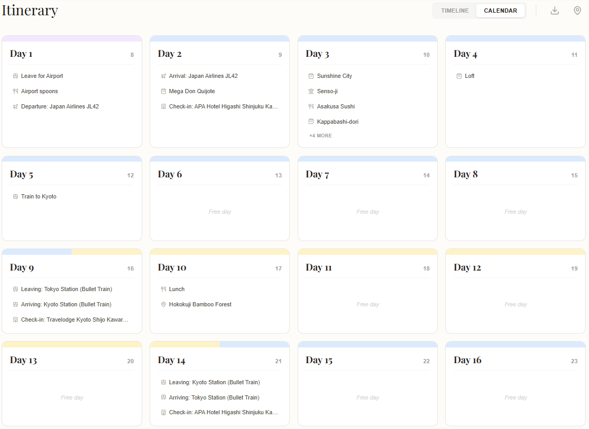

- Places Tab: A page to explore and add potential places to visit, categorising them and allocating them to different regions within the trip. Users can confirm places once they know they'll be going, and mark them as visited, allowing them to rate them and log any costs which are passed to the budget tab*. Users will see any options added by other members of the trip.

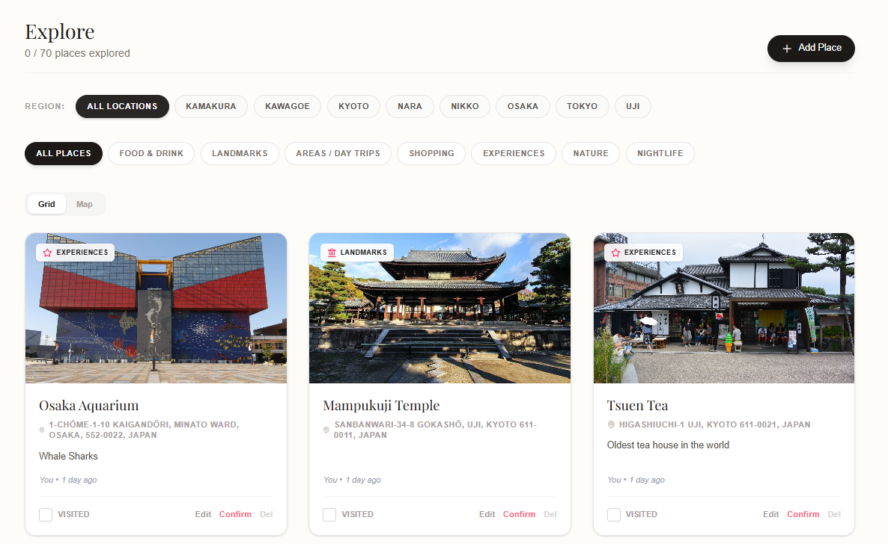

- Wishlist: Users can create a person wishlist consisting of categorised lists of items they may wish to buy whilst they're away, and link these to shops added in the places tab.

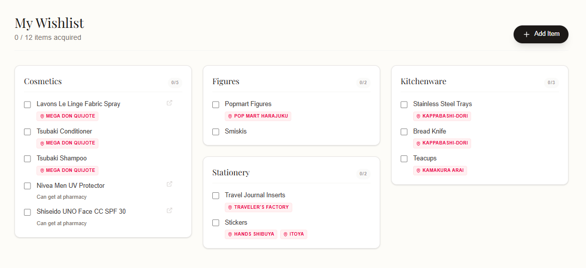

- Photos Tab: A page for all members of the trip to upload photos, and view them in a gallery. Users can also add captions and dates to their photos, which will be used in a later update (alongside itinerary data) to create daily personalised journal pages.

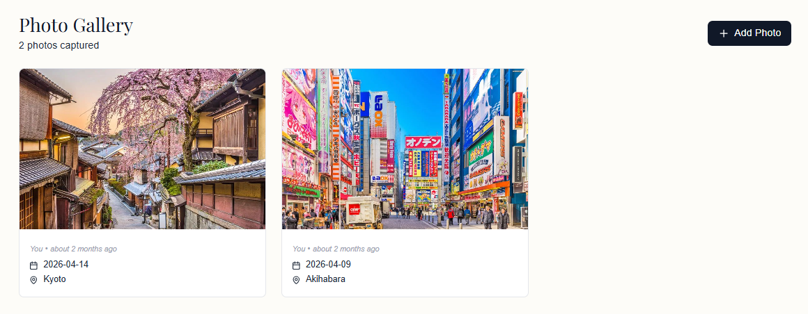

- Admin Tab: A page to handle all aspects of planning the trip, including flights, accomodation, packing list, and more. 

     - Members Tab: A page to view and invite members of the trip. 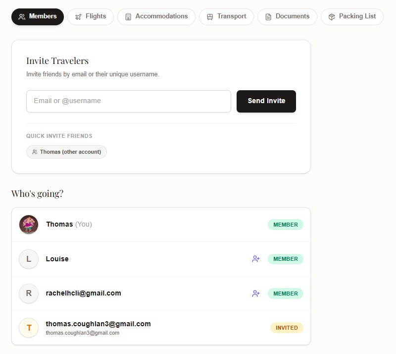
     - Flights Tab: A page to add and view flight details. 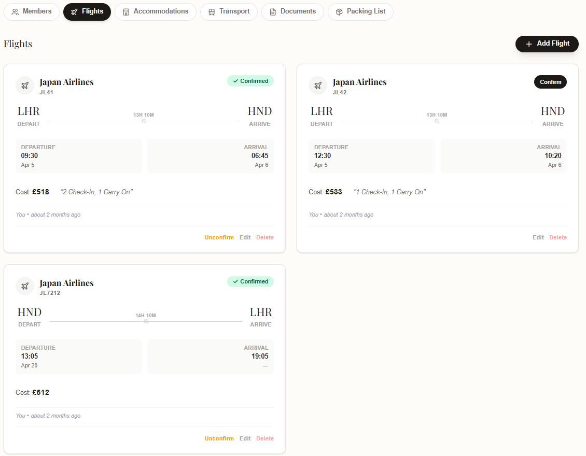
     - Accomodation Tab: A page to add and view accomodation details. 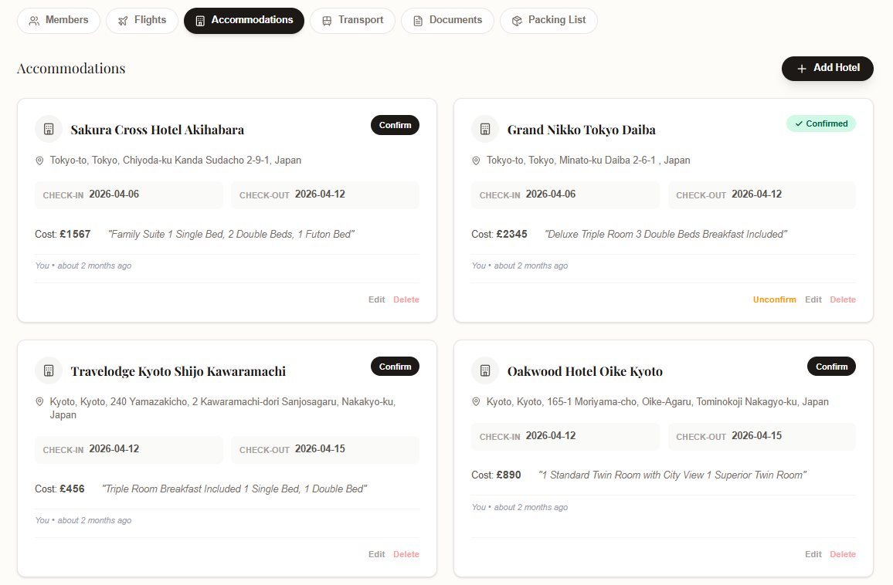
     - Transport Tab: A page to add and view the details of transport within the destination. 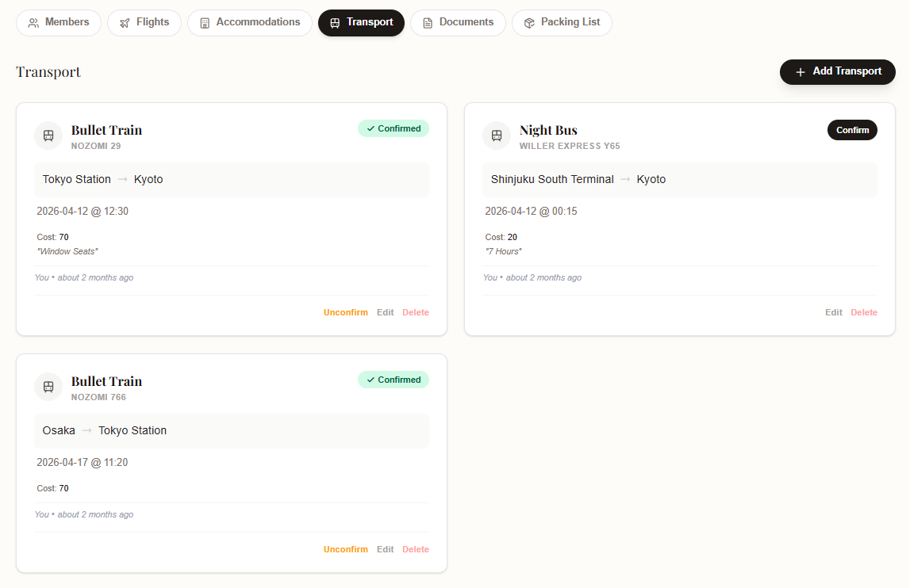
     - Documents Tab: A page to upload and view important documents for the trip, such as tickets, travel insurance, and more. 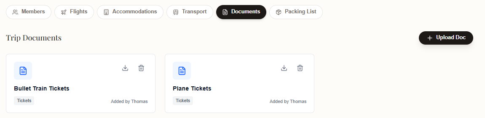
     - Packing List Tab: A page to create and view both shared and personal packing lists, which can be saved as presets and imported from your profile. 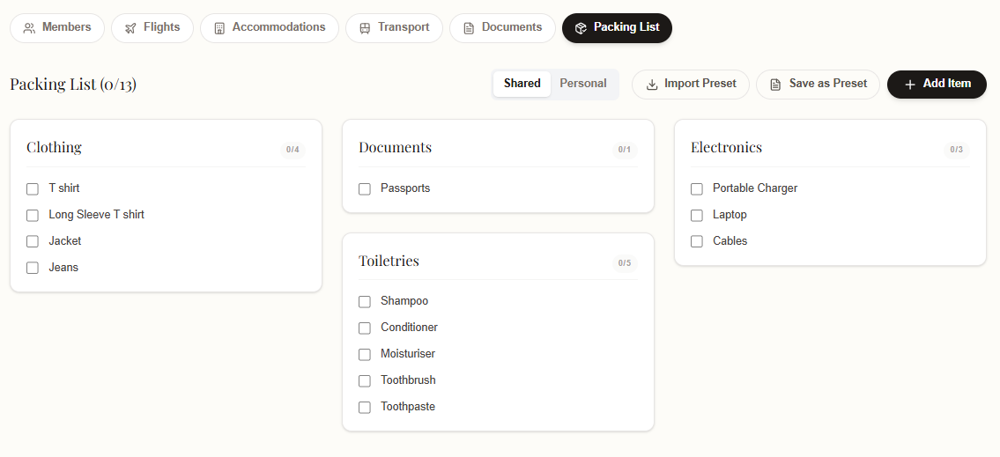

- Budget Tab*: A page to record both the shared and personal costs of trips, and set budgets for different categories. Costs are automatically passed from other tabs (e.g., when a flight is confirmed), but users cam a;sp add costs manually. 

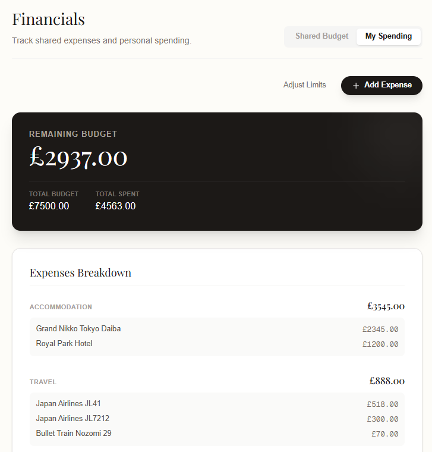

- Notifications to alert users when other members of the trip make additions.

- A profile page to view and edit user details, and save favourite places and packing list presets.

## Tech Stack

- Frontend: Next.js, React, TypeScript
- Backend: Firebase (Firestore, Auth)
- Maps: Google Maps API / Mapbox
- Deployment: Vercel
- Other: EmailJS, date-fns

## Architecture

- Modular data models (Trip, Transport, ItineraryItem)
- Separation of concerns between UI, data, and logic
- Real-time sync using Firebase listeners
- Optimistic UI updates for responsiveness
- Structured storage keys (e.g. trip:${tripId})

## Demo

https://travel-planner-eight-tawny.vercel.app/

## Future Improvements

- Travel Scrapbook: (Work in progress) A page to create a personalised scrapbook of the trip, using photos and itinerary data.
